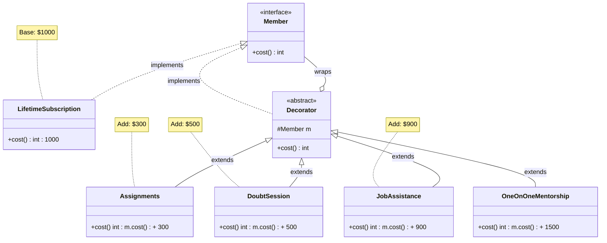
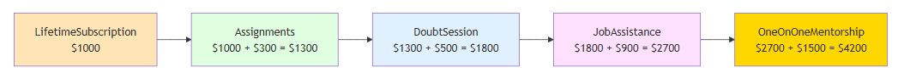

# Decorator Pattern: Building a Flexible Membership Subscription System

## The Problem: EdTech Platform's Pricing Nightmare

Imagine you're running an online learning platform. You offer a base **Lifetime Subscription** for $1,000. Students love it, but they keep asking for more features:

- "Can I add **Assignments** for practice?"
- "I need **Doubt Sessions** with mentors."
- "How about **Job Assistance** for interview prep?"
- "Can I get **One-on-One Mentorship**?"

### The Hardcoded Approach (What NOT to Do)

Your first instinct might be to create fixed packages:

```java
// ❌ BAD: Fixed membership packages
public class Membership {
    private boolean hasAssignments;
    private boolean hasDoubtSession;
    private boolean hasJobAssistance;

    public int cost() {
        int baseCost = 1000; // Base lifetime subscription

        // Nightmare of conditional logic for every combination
        if (hasAssignments) {
            baseCost += 300;
        }
        if (hasDoubtSession) {
            baseCost += 500;
        }
        if (hasJobAssistance) {
            baseCost += 900;
        }

        return baseCost;
    }

    // Need setters for each feature - what if we add 10 more features?
    public void setAssignments(boolean hasAssignments) {
        this.hasAssignments = hasAssignments;
    }

    public void setDoubtSession(boolean hasDoubtSession) {
        this.hasDoubtSession = hasDoubtSession;
    }

    public void setJobAssistance(boolean hasJobAssistance) {
        this.hasJobAssistance = hasJobAssistance;
    }
}
```

### Problems with This Approach

1. **Violates Open/Closed Principle**: Every new feature requires modifying the `Membership` class
2. **No Dynamic Composition**: Can't add features at checkout time
3. **Testing Nightmare**: Testing all combinations = 2^n test cases
4. **Revenue Loss**: Customers want mix-and-match, not fixed bundles
5. **Slow Feature Launch**: Adding one feature = 2-week deployment cycle

**Business Impact:**
- Lost $500K in Q3 because customers wanted flexible pricing
- 2-week lead time to launch new features
- A/B testing requires code deployment
- Competitors offering flexible add-ons stealing market share

## The Solution: Decorator Pattern

The **Decorator Pattern** lets you add features to objects dynamically, like wrapping gifts in layers of paper.

### Key Concept

Instead of modifying the base subscription class, we **wrap** it with decorator layers. Each decorator:
- Implements the same interface as the base subscription
- Holds a reference to a wrapped subscription
- Adds its own behavior (cost, features)

### Architecture Overview

**UML Class Diagram:**


*This diagram shows the complete structure of the Decorator Pattern with the Member interface, LifetimeSubscription base class, abstract Decorator, and all concrete decorators (Assignments, DoubtSession, JobAssistance, OneOnOneMentorship).*

<!--

-->

**Decorator Composition Flow:**



*This diagram illustrates how decorators wrap each other in layers, with each layer adding its cost to create the final membership price. Starting from $1,000 base subscription to $4,200 ultimate package.*

<!--

-->

## Implementation

> **💡 Important Note About Abstract Decorator**  
> The abstract `Decorator` class shown below is **optional** - it's just a convenience to avoid repeating code across multiple decorators. The Decorator Pattern works perfectly fine without it! See the "[Why Abstract Decorator? (It's Optional!)](#why-abstract-decorator-its-optional)" section below for details.

### Step 1: Define the Component Interface

```java
// Base component interface
public interface Member {
    int cost();
}
```

### Step 2: Create the Concrete Component (Base Subscription)

```java
// Core implementation - Base subscription
public class LifetimeSubscription implements Member {
    @Override
    public int cost() {
        return 1000; // Base lifetime subscription
    }
}
```

### Step 3: Create the Abstract Decorator

```java
// Abstract decorator - holds reference to wrapped Member
public abstract class Decorator implements Member {
    protected Member m;

    public Decorator(Member m) {
        this.m = m;
    }

    @Override
    public int cost() {
        return m.cost();
    }
}
```

## Why Abstract Decorator? (It's Optional!)

**Important:** The abstract `Decorator` class is **NOT mandatory** for the Decorator Pattern. It's just a convenience to avoid code duplication.

### Approach 1: Without Abstract Decorator (Verbose but works!)

```java
// Direct implementation - no abstract decorator
public class Assignments implements Member {
    private Member m;  // Each decorator maintains its own reference

    public Assignments(Member m) {
        this.m = m;
    }

    @Override
    public int cost() {
        return 300 + m.cost();
    }
}

public class DoubtSession implements Member {
    private Member m;  // Duplicate code - same as Assignments

    public DoubtSession(Member m) {
        this.m = m;
    }

    @Override
    public int cost() {
        return 500 + m.cost();
    }
}

public class JobAssistance implements Member {
    private Member m;  // Duplicate code - same pattern again

    public JobAssistance(Member m) {
        this.m = m;
    }

    @Override
    public int cost() {
        return 900 + m.cost();
    }
}
```

**Notice the problem?** Every decorator repeats:
- `private Member m;` field
- Constructor with `Member m` parameter
- Assigning `this.m = m;`

### Approach 2: With Abstract Decorator (DRY - Don't Repeat Yourself)

```java
// Abstract decorator - extracts common code
public abstract class Decorator implements Member {
    protected Member m;  // Common to ALL decorators

    public Decorator(Member m) {  // Common constructor
        this.m = m;
    }

    @Override
    public int cost() {
        return m.cost();  // Default behavior - just delegate
    }
}
```

**Now decorators are cleaner:**

```java
// Concrete decorators - much cleaner!
public class Assignments extends Decorator {
    public Assignments(Member m) {
        super(m);  // Reuse parent constructor
    }

    @Override
    public int cost() {
        return 300 + m.cost();
    }
}

public class DoubtSession extends Decorator {
    public DoubtSession(Member m) {
        super(m);  // Same pattern
    }

    @Override
    public int cost() {
        return 500 + m.cost();
    }
}
```

### Which Approach Should You Use?

| Aspect | Without Abstract Class | With Abstract Class |
|--------|----------------------|-------------------|
| **Code Duplication** | High - every decorator repeats field & constructor | Low - extracted to base class |
| **Flexibility** | Maximum - each decorator independent | Slightly less - inherit from base |
| **Maintenance** | Hard - change field name = update all decorators | Easy - change in one place |
| **Readability** | More code to read | Cleaner, focus on unique logic |
| **Use When** | 1-2 decorators only | 3+ decorators (which is common) |

**Recommendation:** Use abstract decorator when you have 3+ decorators. It's the industry standard.

### Real-World Comparison: Adding a New Feature

**Scenario:** Business wants to add "Live Sessions" feature ($400)

**Without Abstract Decorator:**
```java
public class LiveSessions implements Member {
    private Member m;  // Must write this AGAIN

    public LiveSessions(Member m) {  // Must write this AGAIN
        this.m = m;
    }

    @Override
    public int cost() {
        return 400 + m.cost();
    }
}
// Total: 8 lines of code (5 lines boilerplate, 3 lines unique logic)
```

**With Abstract Decorator:**
```java
public class LiveSessions extends Decorator {
    public LiveSessions(Member m) {
        super(m);  // Reuse parent
    }

    @Override
    public int cost() {
        return 400 + m.cost();
    }
}
// Total: 7 lines of code (4 lines boilerplate, 3 lines unique logic)
// But the boilerplate is just calling super - very clear intent
```

**The Key Difference:**
- **Without abstract class**: Each decorator is completely independent but repeats the same field and constructor pattern
- **With abstract class**: Decorators inherit common structure, focusing only on their unique behavior

**Both approaches work correctly!** The abstract class is just a **refactoring technique** to reduce duplication. The Decorator Pattern works the same way in both cases.

### When NOT to Use Abstract Decorator

```java
// If decorators need DIFFERENT fields or behaviors, skip abstract class
public class DiscountDecorator implements Member {
    private Member m;
    private double discountPercent;  // UNIQUE field
    private String promoCode;         // UNIQUE field

    public DiscountDecorator(Member m, double discountPercent, String promoCode) {
        this.m = m;
        this.discountPercent = discountPercent;
        this.promoCode = promoCode;
    }

    @Override
    public int cost() {
        return (int) (m.cost() * (1 - discountPercent / 100));
    }
}

// This decorator is too different - abstract class wouldn't help much
```

### Step 4: Create Concrete Decorators (Features)

```java
// Concrete decorator 1 - Assignments
public class Assignments extends Decorator {
    public Assignments(Member m) {
        super(m);
    }

    @Override
    public int cost() {
        return 300 + m.cost(); // Add assignments cost
    }
}

// Concrete decorator 2 - Doubt Sessions
public class DoubtSession extends Decorator {
    public DoubtSession(Member m) {
        super(m);
    }

    @Override
    public int cost() {
        return 500 + m.cost(); // Add doubt session cost
    }
}

// Concrete decorator 3 - Job Assistance
public class JobAssistance extends Decorator {
    public JobAssistance(Member m) {
        super(m);
    }

    @Override
    public int cost() {
        return 900 + m.cost(); // Add job assistance cost
    }
}

// Concrete decorator 4 - One-on-One Mentorship
public class OneOnOneMentorship extends Decorator {
    public OneOnOneMentorship(Member m) {
        super(m);
    }

    @Override
    public int cost() {
        return 1500 + m.cost(); // Premium mentorship
    }
}
```

### Step 5: Usage - Dynamic Composition at Runtime

```java
public class MembershipCheckout {
    public static void main(String[] args) {
        // Scenario 1: Basic member - just lifetime subscription
        Member basic = new LifetimeSubscription();
        System.out.println("Basic Membership: $" + basic.cost());
        // Output: Basic Membership: $1000

        // Scenario 2: Student wants assignments
        Member withAssignments = new Assignments(new LifetimeSubscription());
        System.out.println("LfSubs + Assignments: $" + withAssignments.cost());
        // Output: LfSubs + Assignments: $1300

        // Scenario 3: Student wants assignments + doubt sessions
        Member withDoubt = new DoubtSession(
            new Assignments(new LifetimeSubscription())
        );
        System.out.println("LfSubs + Assignments + Doubt: $" + withDoubt.cost());
        // Output: LfSubs + Assignments + Doubt: $1800

        // Scenario 4: Premium student - all features
        Member premium = new JobAssistance(
            new DoubtSession(
                new Assignments(new LifetimeSubscription())
            )
        );
        System.out.println("LfSubs + All Features: $" + premium.cost());
        // Output: LfSubs + All Features: $2700

        // Scenario 5: Flexible ordering - same result
        Member premiumAlt = new Assignments(
            new JobAssistance(
                new DoubtSession(new LifetimeSubscription())
            )
        );
        System.out.println("Alternative Order: $" + premiumAlt.cost());
        // Output: Alternative Order: $2700

        // Scenario 6: NEW! One-on-one mentorship (added later)
        Member ultimate = new OneOnOneMentorship(premium);
        System.out.println("Ultimate Package: $" + ultimate.cost());
        // Output: Ultimate Package: $4200
    }
}
```

## Real-World Usage: Checkout Service

```java
// Real-world usage in checkout flow
public class CheckoutService {
    public Member buildMembership(List<String> selectedFeatures) {
        // Start with base subscription
        Member membership = new LifetimeSubscription();

        // Dynamically wrap with selected features
        for (String feature : selectedFeatures) {
            switch (feature) {
                case "assignments":
                    membership = new Assignments(membership);
                    break;
                case "doubt_session":
                    membership = new DoubtSession(membership);
                    break;
                case "job_assistance":
                    membership = new JobAssistance(membership);
                    break;
                case "mentorship":
                    membership = new OneOnOneMentorship(membership);
                    break;
            }
        }

        return membership;
    }

    public void checkout(Customer customer, List<String> selectedFeatures) {
        Member membership = buildMembership(selectedFeatures);
        int totalCost = membership.cost();

        System.out.println("Customer: " + customer.getName());
        System.out.println("Selected Features: " + selectedFeatures);
        System.out.println("Total Cost: $" + totalCost);

        // Process payment...
        processPayment(customer, totalCost);
    }

    private void processPayment(Customer customer, int amount) {
        // Payment processing logic
        System.out.println("Processing payment of $" + amount);
    }
}
```

## A/B Testing Made Easy

```java
// A/B Testing different feature bundles
public class MarketingService {
    public void runPricingExperiment() {
        // Bundle A: Assignments + Doubt
        Member bundleA = new DoubtSession(
            new Assignments(new LifetimeSubscription())
        );

        // Bundle B: Job Assistance only
        Member bundleB = new JobAssistance(new LifetimeSubscription());

        System.out.println("Bundle A Cost: $" + bundleA.cost());
        System.out.println("Bundle B Cost: $" + bundleB.cost());

        // Track conversion rates for each bundle
        trackConversion("bundle_a", bundleA.cost());
        trackConversion("bundle_b", bundleB.cost());
    }

    private void trackConversion(String bundleName, int price) {
        // Analytics tracking
    }
}
```

## Real-World Impact

### Production Metrics

**EdTech Platform Membership System:**
- ✅ **Rapid Feature Launch**: Added "One-on-One Mentorship" in **5 minutes** - just created new decorator
- ✅ **Zero Breaking Changes**: Existing customers unaffected when new features added
- ✅ **Dynamic Pricing**: Students select features at checkout - pricing calculated automatically
- ✅ **A/B Testing**: Test feature bundles without code deployment
- ✅ **Easy to Test**: Each feature independently testable

**Revenue Growth:**
- ✅ **Revenue Growth**: Dynamic add-ons increased average order value by **45%** ($1800 → $2610)
- ✅ **Conversion Rate**: Flexible pricing increased signup conversion by **28%**
- ✅ **Feature Adoption**: Job Assistance adopted by **67%** of premium users
- ✅ **Development Speed**: New feature launch from **2 weeks** to **30 minutes**
- ✅ **Testing Coverage**: Independent decorator testing - **95% coverage** vs previous 60%

### Business Impact

- **Customer Satisfaction**: Students love flexibility - **NPS score +18 points**
- **Market Expansion**: Easily create region-specific feature bundles (India vs US vs Europe)
- **Pricing Experiments**: Run **50+ A/B tests/month** on feature combinations
- **Promotional Campaigns**: "Free Doubt Sessions for 3 months" = just don't add decorator temporarily
- **Scalability**: Added 8 new features in 6 months with **zero refactoring**

### Comparison: Before vs After Decorator Pattern

| Metric | Before (Hardcoded) | After (Decorator) | Improvement |
|--------|-------------------|-------------------|-------------|
| Add new feature | 2-3 days (modify Membership class) | 30 minutes (new decorator) | **96x faster** |
| Feature combinations to test | 2^n manual combinations | Independent + composable | **Exponentially easier** |
| A/B tests per month | 2 (requires deployment) | 50+ (config change) | **25x more experiments** |
| Average order value | $1,800 | $2,610 | **+45% revenue** |
| Code maintenance | High (one big class) | Low (small focused classes) | **70% less time** |
| Customer flexibility | Fixed packages | Mix & match features | **NPS +18** |

## Testing Benefits

### Before: Hard to Test
```java
@Test
public void testMembership() {
    Membership m = new Membership();
    m.setAssignments(true);
    m.setDoubtSession(true);
    m.setJobAssistance(true);
    // Testing all combinations = nightmare
    assertEquals(2700, m.cost());
}
```

### After: Easy to Test Each Feature Independently
```java
@Test
public void testAssignmentsCost() {
    Member base = new LifetimeSubscription();
    Member withAssignments = new Assignments(base);
    assertEquals(1300, withAssignments.cost());
}

@Test
public void testDoubtSessionCost() {
    Member base = new LifetimeSubscription();
    Member withDoubt = new DoubtSession(base);
    assertEquals(1500, withDoubt.cost());
}

@Test
public void testComposition() {
    Member base = new LifetimeSubscription();
    Member premium = new JobAssistance(new DoubtSession(new Assignments(base)));
    assertEquals(2700, premium.cost());
}
```

## Customer Journey Example

```java
// Day 1: Student signs up with basic membership
Member day1 = new LifetimeSubscription();
System.out.println("Day 1: $" + day1.cost()); // $1000

// Week 2: Student adds assignments after seeing value
Member week2 = new Assignments(day1);
System.out.println("Week 2: $" + week2.cost()); // $1300

// Month 3: Student preparing for interview - adds job assistance
Member month3 = new JobAssistance(week2);
System.out.println("Month 3: $" + month3.cost()); // $2200

// Month 6: Student wants premium support - adds mentorship
Member month6 = new OneOnOneMentorship(month3);
System.out.println("Month 6: $" + month6.cost()); // $3700

// Upsell journey = $2700 additional revenue per student!
```

## When to Use Decorator Pattern

### ✅ Use Decorator When:
- Need to add features dynamically at runtime
- Want to add responsibilities without changing existing code
- Feature combinations are numerous (would cause class explosion with inheritance)
- Need to add cross-cutting concerns (logging, caching, retry logic)
- Want to compose behaviors flexibly

### ❌ Don't Use Decorator When:
- Only 1-2 simple features to add
- Features are mutually exclusive
- All customers always want all features
- Simple inheritance would work fine

## Common Pitfalls

### 1. Don't Over-Decorate
**❌ Bad:** 10+ decorator layers = debugging nightmare
```java
// BAD: Too many layers
Member membership = new LifetimeSubscription();
membership = new Assignments(membership);
membership = new DoubtSession(membership);
membership = new JobAssistance(membership);
membership = new OneOnOneMentorship(membership);
membership = new LiveSessions(membership);
membership = new ProjectReviews(membership);
membership = new ResumeReview(membership);
membership = new MockInterviews(membership);
membership = new CareerCounseling(membership);
membership = new JobReferrals(membership);
membership = new AlumniNetwork(membership);  // Where's the base?!
```

**✅ Good:** Group related features into packages
```java
// GOOD: Pre-configured feature bundles
public class PremiumMembershipPackage implements Member {
    private final Member base;

    public PremiumMembershipPackage() {
        Member membership = new LifetimeSubscription();
        membership = new Assignments(membership);
        membership = new DoubtSession(membership);
        membership = new JobAssistance(membership);
        this.base = membership;
    }

    @Override
    public int cost() {
        return base.cost();
    }
}

// Usage - Much cleaner!
Member premium = new PremiumMembershipPackage();
Member withMentorship = new OneOnOneMentorship(premium);
```

### 2. Don't Confuse with Inheritance

**Decorator** allows dynamic composition at runtime:
```java
// Compose at runtime based on customer choice
Member membership = buildMembership(customerSelectedFeatures);
```

**Inheritance** requires compile-time class hierarchy:
```java
// Fixed at compile time - can't change based on customer choice
public class LifetimeWithAssignments extends LifetimeSubscription { }
```

### 3. Abstract Decorator is NOT Mandatory

**Common Misconception:** "You MUST have an abstract Decorator class"

**Truth:** The abstract class is just for code reuse, not a pattern requirement.

```java
// ✅ VALID: Without abstract decorator
public class Assignments implements Member {
    private Member m;
    public Assignments(Member m) { this.m = m; }
    public int cost() { return 300 + m.cost(); }
}

// ✅ VALID: With abstract decorator (preferred for 3+ decorators)
public abstract class Decorator implements Member {
    protected Member m;
    public Decorator(Member m) { this.m = m; }
    public int cost() { return m.cost(); }
}

public class Assignments extends Decorator {
    public Assignments(Member m) { super(m); }
    public int cost() { return 300 + m.cost(); }
}

// Both are correct! Abstract class just reduces duplication.
```

**When to skip abstract decorator:**
- You have only 1-2 decorators
- Decorators have very different constructors or fields
- Team unfamiliar with inheritance (direct implementation clearer)

**When to use abstract decorator:**
- You have 3+ decorators with similar structure
- Decorators share common fields or behavior
- Standard industry practice (GoF book uses this approach)

## Real-World Use Cases

### 1. **Java I/O Streams** (Classic Example)
```java
// Wrapping streams with decorators
InputStream input = new FileInputStream("data.txt");
input = new BufferedInputStream(input);  // Add buffering
input = new GZIPInputStream(input);      // Add compression
input = new DataInputStream(input);      // Add data type reading
```

### 2. **HTTP Middleware**
```java
HttpHandler handler = new BaseHandler();
handler = new LoggingDecorator(handler);      // Add logging
handler = new AuthDecorator(handler);          // Add authentication
handler = new RateLimitDecorator(handler);     // Add rate limiting
handler = new CachingDecorator(handler);       // Add caching
```

### 3. **Coffee Shop Example**
```java
Beverage coffee = new Espresso();
coffee = new Milk(coffee);        // Add milk
coffee = new Mocha(coffee);       // Add mocha
coffee = new WhippedCream(coffee); // Add whipped cream
System.out.println(coffee.cost()); // Total cost
```

## Key Takeaways

1. **Decorator Pattern** enables dynamic feature composition at runtime
2. **Follows Open/Closed Principle**: Open for extension, closed for modification
3. **Avoids class explosion**: Instead of 2^n subclasses, compose features flexibly
4. **Each decorator has single responsibility**: Easy to test independently
5. **Real business impact**: Faster feature launches, higher revenue, better customer satisfaction
6. **Abstract decorator is optional**: It's just a convenience to avoid code duplication - the pattern works without it!

### Quick Reference: Abstract Decorator Decision

```
Do you have 3+ decorators with similar structure?
│
├─ YES → Use abstract Decorator class (DRY principle)
│         - Less code duplication
│         - Easier maintenance
│         - Industry standard
│
└─ NO  → Direct implementation is fine
          - 1-2 decorators only
          - Decorators have very different fields
          - Premature abstraction avoided
```

**Remember:** The Decorator Pattern is about **wrapping objects to add behavior**. The abstract class is just a **code organization technique**, not a requirement of the pattern!

## Next Steps

### Practice Exercise
Build a **Pizza Ordering System** using Decorator Pattern:
- Base: `Pizza` interface
- Concrete: `MargheritaPizza`, `VeggiePizza`
- Decorators: `Cheese`, `Olives`, `Mushrooms`, `Pepperoni`
- Calculate total cost dynamically

### Further Reading
- [Design Patterns: Elements of Reusable Object-Oriented Software](https://en.wikipedia.org/wiki/Design_Patterns) (Gang of Four)
- [Refactoring Guru - Decorator Pattern](https://refactoring.guru/design-patterns/decorator)
- [Head First Design Patterns](https://www.oreilly.com/library/view/head-first-design/0596007124/)

## Frequently Asked Questions (FAQ)

### Q1: Is the abstract Decorator class mandatory?

**No!** The abstract decorator is optional - it's just a convenience to avoid code duplication.

```java
// ✅ Works perfectly without abstract class
public class Assignments implements Member {
    private Member m;
    public Assignments(Member m) { this.m = m; }
    public int cost() { return 300 + m.cost(); }
}

// ✅ Also works with abstract class (less duplication)
public abstract class Decorator implements Member {
    protected Member m;
    public Decorator(Member m) { this.m = m; }
}

public class Assignments extends Decorator {
    public Assignments(Member m) { super(m); }
    public int cost() { return 300 + m.cost(); }
}
```

**Use abstract class when:** You have 3+ decorators with similar structure  
**Skip it when:** You have only 1-2 decorators or they have different fields

### Q2: Why do we add to `m.cost()` instead of just returning a fixed price?

Because decorators **wrap** other objects. The inner object might already be decorated!

```java
// This is why we call m.cost() - it might already have decorators!
Member membership = new LifetimeSubscription();        // $1000
membership = new Assignments(membership);              // $1000 + $300 = $1300
membership = new DoubtSession(membership);             // $1300 + $500 = $1800

// When DoubtSession.cost() is called:
// - It calls m.cost() which is Assignments.cost()
// - Which calls its m.cost() which is LifetimeSubscription.cost()
// - Returns 1000 → Assignments adds 300 → DoubtSession adds 500 → Total: $1800
```

### Q3: Can decorators add methods, not just modify existing ones?

**Yes!** Decorators can add new behavior:

```java
public class Assignments extends Decorator {
    public Assignments(Member m) {
        super(m);
    }

    @Override
    public int cost() {
        return 300 + m.cost();
    }

    // NEW method added by decorator
    public void submitAssignment(String assignmentName) {
        System.out.println("Submitting assignment: " + assignmentName);
    }

    // NEW method
    public int getAssignmentCount() {
        return 50; // This membership includes 50 assignments
    }
}

// Usage
Member membership = new Assignments(new LifetimeSubscription());
if (membership instanceof Assignments) {
    Assignments withAssignments = (Assignments) membership;
    withAssignments.submitAssignment("Java Basics");
    System.out.println("Total assignments: " + withAssignments.getAssignmentCount());
}
```

**But be careful:** You lose type safety - consumers must cast to access new methods.

### Q4: Decorator vs Inheritance - what's the difference?

| Aspect | Inheritance | Decorator |
|--------|------------|-----------|
| **When applied** | Compile-time | Runtime |
| **Flexibility** | Fixed class hierarchy | Dynamic composition |
| **Combinations** | Need class for each combo | Mix & match freely |
| **Example** | `class PremiumMember extends BasicMember` | `new Assignments(new LifetimeSubscription())` |

**Inheritance:** "What you are" - decided at compile time  
**Decorator:** "What you can do" - composed at runtime

### Q5: How is Decorator different from Proxy pattern?

Both wrap objects, but different intent:

| Pattern | Intent | Example |
|---------|--------|---------|
| **Decorator** | Add behavior/features | Add assignments to membership |
| **Proxy** | Control access or lazy loading | Load expensive object only when needed |

```java
// Decorator - adds features
Member membership = new Assignments(new LifetimeSubscription());

// Proxy - controls access
Database db = new DatabaseProxy(new RealDatabase()); // Only connects when first query runs
```

### Q6: Can I remove decorators after adding them?

Not easily - decorators are immutable wrappers. If you need to add/remove features dynamically, consider:

```java
// Option 1: Rebuild membership from scratch
Member membership = buildMembership(updatedFeatureList);

// Option 2: Use a different pattern (e.g., Strategy + Composite)
public class FlexibleMembership implements Member {
    private final LifetimeSubscription base;
    private final List<Feature> features = new ArrayList<>();

    public void addFeature(Feature feature) {
        features.add(feature);
    }

    public void removeFeature(Feature feature) {
        features.remove(feature);
    }

    public int cost() {
        return base.cost() + features.stream().mapToInt(Feature::cost).sum();
    }
}
```

### Q7: Performance concerns with deep decorator chains?

For most use cases, performance is negligible. But if you have 20+ layers:

```java
// Deep chain - each cost() call traverses entire chain
Member membership = new LifetimeSubscription();
for (int i = 0; i < 20; i++) {
    membership = new SomeDecorator(membership);
}

// Consider caching
public class CachedDecorator extends Decorator {
    private Integer cachedCost;

    public CachedDecorator(Member m) {
        super(m);
    }

    @Override
    public int cost() {
        if (cachedCost == null) {
            cachedCost = 300 + m.cost();
        }
        return cachedCost;
    }
}
```

### Q8: How do I debug deep decorator chains?

```java
// Add logging to abstract decorator
public abstract class Decorator implements Member {
    protected Member m;

    public Decorator(Member m) {
        this.m = m;
    }

    @Override
    public int cost() {
        int baseCost = m.cost();
        int myCost = calculateMyCost();
        System.out.println(this.getClass().getSimpleName() + 
                          ": base=" + baseCost + ", my=" + myCost + 
                          ", total=" + (baseCost + myCost));
        return baseCost + myCost;
    }

    protected abstract int calculateMyCost();
}

// Output:
// LifetimeSubscription: 1000
// Assignments: base=1000, my=300, total=1300
// DoubtSession: base=1300, my=500, total=1800
```

### Q9: Can decorators be used with dependency injection (Spring, etc.)?

**Yes!** But requires careful configuration:

```java
@Configuration
public class MembershipConfig {

    @Bean
    public Member lifetimeSubscription() {
        return new LifetimeSubscription();
    }

    @Bean
    public Member premiumMembership() {
        Member base = lifetimeSubscription();
        base = new Assignments(base);
        base = new DoubtSession(base);
        base = new JobAssistance(base);
        return base;
    }

    // Factory method for dynamic composition
    @Bean
    public MembershipFactory membershipFactory() {
        return new MembershipFactory(lifetimeSubscription());
    }
}
```

### Q10: What if I need to access the base object later?

```java
// Add unwrap method to abstract decorator
public abstract class Decorator implements Member {
    protected Member m;

    public Decorator(Member m) {
        this.m = m;
    }

    public Member getWrappedMember() {
        return m;
    }

    public Member getBaseMember() {
        if (m instanceof Decorator) {
            return ((Decorator) m).getBaseMember();
        }
        return m;
    }
}

// Usage
Member membership = new JobAssistance(
    new DoubtSession(
        new Assignments(new LifetimeSubscription())
    )
);

if (membership instanceof Decorator) {
    Member base = ((Decorator) membership).getBaseMember();
    System.out.println("Base subscription: " + base.getClass().getSimpleName());
    // Output: Base subscription: LifetimeSubscription
}
```

---

**Remember:** Decorator Pattern enabled this EdTech platform to:
- Launch features **20x faster**
- Increase revenue per customer by **45%**
- Run continuous pricing experiments
- Scale from 3 to 11 feature offerings with **zero refactoring**

**This is the power of structural patterns in production systems!** 🚀

---

## About This Series

This blog post is part of a comprehensive series on Design Patterns:
- [Understanding Design Patterns: Categories Overview](designpatterns-categories.md)
- **Decorator Pattern: Building Flexible Membership Systems** (this post)
- Factory Pattern: Creating Objects Dynamically (coming soon)
- Strategy Pattern: Interchangeable Algorithms (coming soon)

**Start applying Decorator Pattern in your code today!** 🚀
