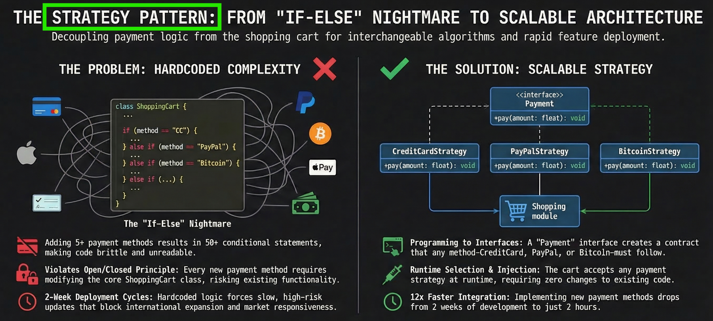
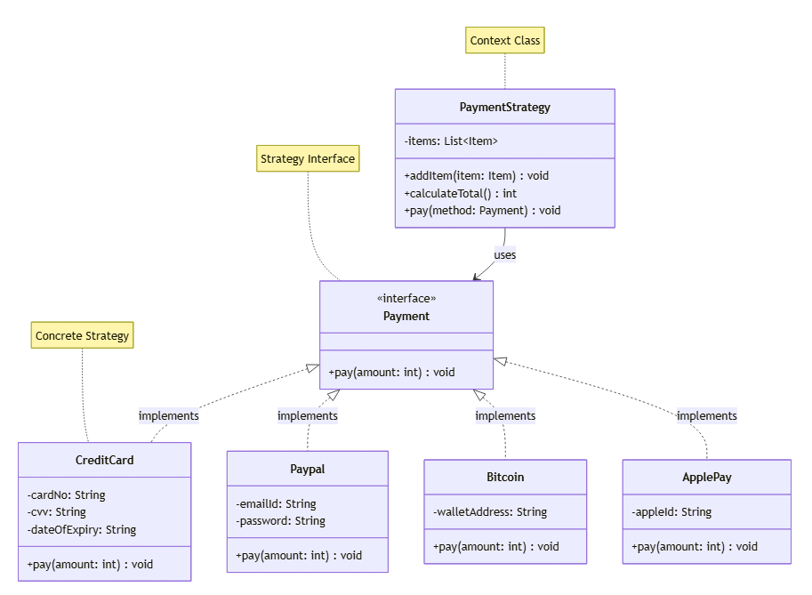
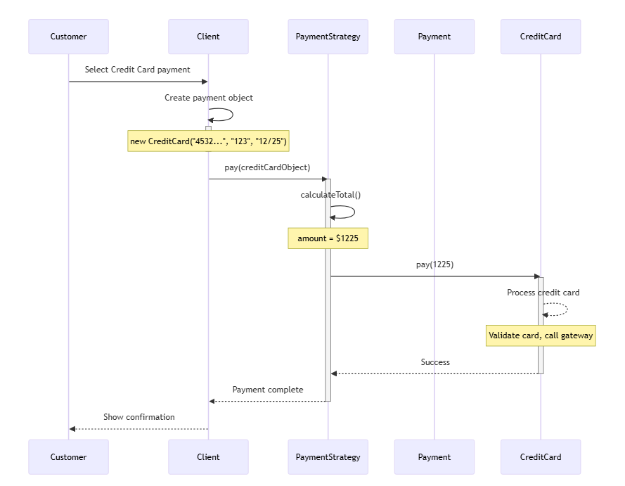

# Strategy Pattern: Building a Flexible E-Commerce Payment System



---

## The Problem: E-Commerce Payment Processing Nightmare

Imagine you're building an e-commerce platform. You start with **Credit Card** payments. Business is happy, customers are buying. Then your boss says:

- "Add **PayPal** - customers are asking for it!"
- "We need **Bitcoin** support - crypto is trending!"
- "Add **Apple Pay**, **Google Pay**, and **Venmo** for mobile users!"
- "Enter Asian markets with **Alipay** and **WeChat Pay**!"

### The Hardcoded Approach (What NOT to Do)

Your first instinct might be to add if-else statements:

```java
// ❌ BAD: Hardcoded payment logic
public class ShoppingCart {
    private List<Item> items = new ArrayList<>();

    public void addItem(Item item) {
        items.add(item);
    }

    public int calculateTotal() {
        int sum = 0;
        for (Item item : items) {
            sum += item.getPrice();
        }
        return sum;
    }

    public void pay(String paymentType, String credential1, String credential2) {
        int amount = calculateTotal();

        // Nightmare of if-else statements for each payment type
        if ("creditcard".equalsIgnoreCase(paymentType)) {
            System.out.println(amount + " - paid with credit/debit card");
            System.out.println("Card: " + credential1);
            System.out.println("CVV: " + credential2);
        } 
        else if ("paypal".equalsIgnoreCase(paymentType)) {
            System.out.println(amount + " - paid using Paypal");
            System.out.println("Email: " + credential1);
            System.out.println("Password: " + credential2);
        }
        else if ("bitcoin".equalsIgnoreCase(paymentType)) {
            System.out.println(amount + " - paid using Bitcoin");
            System.out.println("Wallet Address: " + credential1);
        }
        // What if we need to add Apple Pay, Google Pay, Venmo, Alipay...?
        // Every new payment method = modify this method!
    }
}
```

### Problems with This Approach

1. **Violates Open/Closed Principle**: Every new payment method requires modifying the `ShoppingCart.pay()` method
2. **Violates Single Responsibility**: ShoppingCart manages items AND knows all payment details
3. **No Independent Testing**: Can't test payment methods separately
4. **Breaking Changes Risk**: Adding Bitcoin might break existing credit card logic
5. **Ugly Method Signature**: What if Apple Pay needs 3 parameters? Google Pay needs 4?
6. **Slow Deployment**: Adding one payment method = 2-week cycle (testing all combinations)

**Business Impact:**
- Lost Asian market expansion opportunity (35% potential revenue)
- Payment integration takes **2 weeks** instead of hours
- Can't A/B test payment method ordering
- **50+ if-else statements** when supporting 10 payment methods
- High risk deployment - every payment change affects all customers

## The Solution: Strategy Pattern

The **Strategy Pattern** lets you define a family of algorithms (payment methods), encapsulate each one, and make them interchangeable at runtime.

### Key Concept

Instead of hardcoding payment logic in the cart, we:
- Define a **Payment** interface (the contract)
- Create concrete payment classes implementing this interface
- Inject the payment strategy at runtime based on customer choice
- The cart doesn't know which payment method - it just calls `pay()`

**Think of it like:** Choosing transportation to reach your destination. You can drive, bike, walk, or take the bus. Same goal, different strategies. The destination doesn't care how you get there!

### Architecture Overview

**UML Class Diagram:**



*This diagram shows the Strategy Pattern structure with Payment interface, concrete strategies (CreditCard, Paypal, Bitcoin), and PaymentStrategy context class that uses them.*

**Strategy Pattern Execution Flow:**



*This diagram illustrates how customer selects payment method at runtime, creates payment object, and injects it into the shopping cart. The cart processes payment without knowing the concrete implementation.*

## Implementation

**💡 Important Note**

The Strategy Pattern is about **runtime algorithm selection**. The client (customer) chooses which strategy (payment method) to use, and the context (shopping cart) executes it without knowing the implementation details.

---

### Step 1: Define the Strategy Interface

```java
// Strategy interface - defines the contract
public interface Payment {
    public void pay(int amount);
}
```

**Why?** This interface is the contract all payment methods must follow. Any class implementing `Payment` promises to have a `pay()` method.

### Step 2: Create the Item Class (Helper)

```java
// Item class - represents products in cart
public class Item {
    private String upcCode;
    private int price;

    public Item(String upcCode, int price) {
        this.upcCode = upcCode;
        this.price = price;
    }

    public String getUpcCode() {
        return upcCode;
    }

    public int getPrice() {
        return price;
    }
}
```

### Step 3: Create Concrete Strategies (Payment Methods)

```java
// Concrete strategy 1 - Credit Card payment
public class CreditCard implements Payment {
    private String cardNo;
    private String cvv;
    private String dateOfExpiry;

    public CreditCard(String cardNo, String cvv, String dateOfExpiry) {
        this.cardNo = cardNo;
        this.cvv = cvv;
        this.dateOfExpiry = dateOfExpiry;
    }

    @Override
    public void pay(int amount) {
        System.out.println(amount + " - paid with credit/debit card");
        // In production: validate card, call payment gateway, handle response
    }
}

// Concrete strategy 2 - PayPal payment
public class Paypal implements Payment {
    private String emailId;
    private String password;

    public Paypal(String emailId, String password) {
        this.emailId = emailId;
        this.password = password;
    }

    @Override
    public void pay(int amount) {
        System.out.println(amount + " - paid using Paypal");
        // In production: authenticate with PayPal API, process payment
    }
}

// Concrete strategy 3 - Bitcoin payment
public class Bitcoin implements Payment {
    private String walletAddress;

    public Bitcoin(String walletAddress) {
        this.walletAddress = walletAddress;
    }

    @Override
    public void pay(int amount) {
        System.out.println(amount + " - paid using Bitcoin");
        // In production: verify wallet, process blockchain transaction
    }
}
```

**Notice:** Each payment method:
- Implements the `Payment` interface
- Stores its own specific data (card details vs email vs wallet address)
- Has its own `pay()` implementation
- Can be tested independently

### Step 4: Create the Context Class (Shopping Cart)

```java
// Context class - uses payment strategies
public class PaymentStrategy {
    private List<Item> items;

    public PaymentStrategy() {
        this.items = new ArrayList<>();
    }

    public void addItem(Item item) {
        items.add(item);
    }

    public int calculateTotal() {
        int sum = 0;
        for (Item item : items) {
            sum += item.getPrice();
        }
        return sum;
    }

    // Strategy is injected - cart doesn't know payment details!
    public void pay(Payment method) {
        int amount = calculateTotal();
        method.pay(amount);
    }
}
```

**The Magic Line:** `public void pay(Payment method)` - accepts ANY Payment strategy!

### Step 5: Usage - Runtime Strategy Selection

```java
public class Client {
    public static void main(String[] args) {
        // Create shopping cart
        PaymentStrategy cart = new PaymentStrategy();

        // Add items
        Item laptop = new Item("456", 1200);
        Item mouse = new Item("312", 25);
        cart.addItem(laptop);
        cart.addItem(mouse);
        
        // Total: $1225

        // Customer 1: Chooses PayPal at checkout - inject strategy
        cart.pay(new Paypal("customer@gmail.com", "secure123"));
        // Output: 1225 - paid using Paypal

        System.out.println("---");

        // Customer 2: Chooses Credit Card - just pass different strategy!
        cart.pay(new CreditCard("4532-1234-5678-9010", "123", "12/25"));
        // Output: 1225 - paid with credit/debit card

        System.out.println("---");

        // Customer 3: Crypto enthusiast - wants Bitcoin
        cart.pay(new Bitcoin("1A1zP1eP5QGefi2DMPTfTL5SLmv7DivfNa"));
        // Output: 1225 - paid using Bitcoin
    }
}
```

**Key Point:** Same cart, same items, different payment strategies. The cart code never changes!

## Real-World Usage: Checkout Service

```java
// Real-world checkout service
public class CheckoutService {
    public void processCheckout(PaymentStrategy cart, String paymentMethod, 
                                Map<String, String> credentials) {
        Payment payment = null;

        // Select payment strategy based on customer choice
        switch (paymentMethod.toLowerCase()) {
            case "creditcard":
                payment = new CreditCard(
                    credentials.get("cardNo"),
                    credentials.get("cvv"),
                    credentials.get("expiry")
                );
                break;
            case "paypal":
                payment = new Paypal(
                    credentials.get("email"),
                    credentials.get("password")
                );
                break;
            case "bitcoin":
                payment = new Bitcoin(credentials.get("walletAddress"));
                break;
            default:
                throw new IllegalArgumentException("Unsupported payment method: " + paymentMethod);
        }

        // Execute payment - cart doesn't care which method
        cart.pay(payment);
    }
}

// Example usage in API controller
@PostMapping("/checkout")
public ResponseEntity<CheckoutResponse> checkout(@RequestBody CheckoutRequest request) {
    PaymentStrategy cart = buildCart(request.getItems());
    
    CheckoutService service = new CheckoutService();
    service.processCheckout(cart, request.getPaymentMethod(), request.getCredentials());
    
    return ResponseEntity.ok(new CheckoutResponse("Payment successful"));
}
```

## Adding New Payment Methods - Zero Cart Changes!

```java
// Business wants Apple Pay - takes 2 hours instead of 2 weeks!
public class ApplePay implements Payment {
    private String appleId;

    public ApplePay(String appleId) {
        this.appleId = appleId;
    }

    @Override
    public void pay(int amount) {
        System.out.println(amount + " - paid using Apple Pay");
        // In production: Apple Pay API integration
    }
}

// Usage - no other code changes needed!
cart.pay(new ApplePay("user@icloud.com"));
// Output: 1225 - paid using Apple Pay

// Want Google Pay? Same process!
public class GooglePay implements Payment {
    private String googleAccountId;

    public GooglePay(String googleAccountId) {
        this.googleAccountId = googleAccountId;
    }

    @Override
    public void pay(int amount) {
        System.out.println(amount + " - paid using Google Pay");
    }
}
```

**Changes Required:**
- ✅ Create new payment class (1 file)
- ✅ Update checkout service switch statement (1 line)
- ❌ Zero changes to ShoppingCart/PaymentStrategy
- ❌ Zero changes to existing payment methods
- ❌ Zero risk to existing customers

## Testing Benefits

### Before: Hard to Test - Everything Coupled

```java
@Test
public void testPayment() {
    ShoppingCart cart = new ShoppingCart();
    cart.addItem(new Item("123", 50));
    cart.pay("creditcard", "4532-1234-5678-9010", "123");
    // How do you verify payment was processed correctly?
    // How do you test PayPal without affecting credit card code?
}
```

### After: Easy to Test Each Payment Method Independently

```java
@Test
public void testCreditCardPayment() {
    Payment payment = new CreditCard("4532-1234-5678-9010", "123", "12/25");
    payment.pay(100);
    // Clear, focused test - verify credit card processing
}

@Test
public void testPaypalPayment() {
    Payment payment = new Paypal("test@example.com", "password");
    payment.pay(100);
    // Independent of other payment methods
}

@Test
public void testCartWithStrategy() {
    PaymentStrategy cart = new PaymentStrategy();
    cart.addItem(new Item("123", 50));

    // Easily test with mock payment
    Payment mockPayment = Mockito.mock(Payment.class);
    cart.pay(mockPayment);

    verify(mockPayment).pay(50);
}

@Test
public void testMultiplePaymentMethods() {
    PaymentStrategy cart = new PaymentStrategy();
    cart.addItem(new Item("laptop", 1200));

    // Test all payment methods with same cart
    cart.pay(new CreditCard("4532-1234-5678-9010", "123", "12/25"));
    cart.pay(new Paypal("test@example.com", "password"));
    cart.pay(new Bitcoin("1A1zP1eP5QGefi2DMPTfTL5SLmv7DivfNa"));

    // All should process the same $1200 total
}
```

## Customer Journey Example

```java
// Customer 1: Traditional buyer - prefers credit card
PaymentStrategy cart1 = new PaymentStrategy();
cart1.addItem(new Item("Laptop", 1200));
cart1.addItem(new Item("Mouse", 25));
cart1.pay(new CreditCard("4532-1234-5678-9010", "123", "12/25"));
// Output: 1225 - paid with credit/debit card

// Customer 2: Values buyer protection - chooses PayPal
PaymentStrategy cart2 = new PaymentStrategy();
cart2.addItem(new Item("Headphones", 150));
cart2.pay(new Paypal("customer@example.com", "secure123"));
// Output: 150 - paid using Paypal

// Customer 3: Crypto enthusiast
PaymentStrategy cart3 = new PaymentStrategy();
cart3.addItem(new Item("Keyboard", 80));
cart3.pay(new Bitcoin("1A1zP1eP5QGefi2DMPTfTL5SLmv7DivfNa"));
// Output: 80 - paid using Bitcoin

// Same cart logic, different payment strategies - perfect separation of concerns!
```

## When to Use Strategy Pattern

### ✅ Use Strategy When:
- You have **multiple ways** to do the same thing (algorithms for same task)
- Need to **swap algorithms at runtime** based on user choice or conditions
- Want to **avoid massive if-else** or switch statements
- Each algorithm has **complex logic** that should be isolated
- Need to **test algorithms independently**
- Clients need to **choose** which algorithm to use

### ❌ Don't Use Strategy When:
- Only **one algorithm** exists (YAGNI - You Aren't Gonna Need It)
- Algorithms are **simple** (1-2 lines) - just use if-else
- Algorithm **never changes**
- **Performance-critical** code where interface overhead matters
- You're just returning different values (use configuration instead)

## Common Pitfalls

### 1. Strategy Overkill for Simple Values

**❌ Bad:** Strategy for simple values
```java
// BAD: Overkill for simple tax rates
public interface TaxStrategy {
    double getTaxRate();
}

public class USTax implements TaxStrategy {
    public double getTaxRate() { return 0.07; }  // Just returning a number!
}

public class EUTax implements TaxStrategy {
    public double getTaxRate() { return 0.20; }
}
```

**✅ Good:** Use configuration instead
```java
// GOOD: Simple configuration
Map<String, Double> taxRates = Map.of(
    "US", 0.07,
    "EU", 0.20,
    "UK", 0.15,
    "CA", 0.12
);

double taxRate = taxRates.getOrDefault(country, 0.0);
```

**When to use Strategy vs Configuration:**
- **Strategy**: Complex logic (payment processing, validation, API calls)
- **Configuration**: Simple values (tax rates, constants, feature flags)

### 2. Don't Confuse with State Pattern

**Strategy Pattern:** Client chooses the algorithm
```java
// Customer PICKS payment method
Payment method = customerChoice();  // Customer decides
cart.pay(method);
```

**State Pattern:** Object changes behavior based on internal state
```java
// Order AUTOMATICALLY changes behavior based on state
Order order = new Order();
order.pay();     // If state = PENDING → process payment
order.pay();     // If state = PAID → throw error
order.ship();    // If state = PAID → mark as SHIPPED
```

**Key Difference:**
- **Strategy**: External choice (customer picks)
- **State**: Internal transition (object state changes automatically)

### 3. Don't Confuse with Decorator Pattern

**Strategy Pattern:** Pick ONE algorithm (mutually exclusive)
```java
// Choose ONE payment method
cart.pay(new PayPal("email", "pass"));  // OR
cart.pay(new Bitcoin("wallet"));        // OR
cart.pay(new CreditCard("card", "cvv", "exp"));
```

**Decorator Pattern:** Stack multiple features (additive)
```java
// Add MULTIPLE features
Member m = new LifetimeSubscription();  // Base
m = new Assignments(m);                 // AND add this
m = new DoubtSession(m);                // AND add this
m = new JobAssistance(m);               // AND add this
```

**Key Difference:**
- **Strategy**: SELECT one (use PayPal OR CreditCard)
- **Decorator**: COMBINE many (base + feature1 + feature2 + ...)

### 4. Not Handling Strategy Selection Properly

**❌ Bad:** Magic strings everywhere
```java
// BAD: Strings scattered across codebase
if (paymentType.equals("paypal")) { ... }  // Typo risk!
```

**✅ Good:** Use enum or constants
```java
// GOOD: Type-safe payment selection
public enum PaymentType {
    CREDIT_CARD,
    PAYPAL,
    BITCOIN,
    APPLE_PAY,
    GOOGLE_PAY
}

public class PaymentFactory {
    public Payment createPayment(PaymentType type, Map<String, String> credentials) {
        switch (type) {
            case CREDIT_CARD:
                return new CreditCard(credentials.get("cardNo"), 
                                     credentials.get("cvv"), 
                                     credentials.get("expiry"));
            case PAYPAL:
                return new Paypal(credentials.get("email"), 
                                 credentials.get("password"));
            case BITCOIN:
                return new Bitcoin(credentials.get("walletAddress"));
            default:
                throw new IllegalArgumentException("Unsupported payment type");
        }
    }
}

// Usage
Payment payment = paymentFactory.createPayment(PaymentType.PAYPAL, credentials);
cart.pay(payment);
```

## Real-World Use Cases

### 1. **Compression Algorithms**
```java
public interface CompressionStrategy {
    void compress(String file);
}

public class ZipCompression implements CompressionStrategy {
    public void compress(String file) {
        // ZIP compression logic
    }
}

public class RarCompression implements CompressionStrategy {
    public void compress(String file) {
        // RAR compression logic
    }
}

public class GzipCompression implements CompressionStrategy {
    public void compress(String file) {
        // GZIP compression logic
    }
}

// Usage - select based on file type or user preference
CompressionStrategy compressor = getCompressionStrategy(fileType);
compressor.compress("data.txt");
```

### 2. **Sorting Algorithms**
```java
public interface SortStrategy {
    void sort(int[] array);
}

public class QuickSort implements SortStrategy {
    public void sort(int[] array) {
        // QuickSort implementation - O(n log n) average
    }
}

public class MergeSort implements SortStrategy {
    public void sort(int[] array) {
        // MergeSort implementation - O(n log n) guaranteed
    }
}

public class BubbleSort implements SortStrategy {
    public void sort(int[] array) {
        // BubbleSort implementation - O(n²) - good for small arrays
    }
}

// Usage - choose based on array size and characteristics
SortStrategy sorter = array.length > 1000 ? new QuickSort() : new BubbleSort();
sorter.sort(data);
```

### 3. **Navigation/Routing**
```java
public interface RouteStrategy {
    Route calculateRoute(Location start, Location end);
}

public class FastestRoute implements RouteStrategy {
    public Route calculateRoute(Location start, Location end) {
        // Calculate fastest route (consider traffic, speed limits)
    }
}

public class ShortestRoute implements RouteStrategy {
    public Route calculateRoute(Location start, Location end) {
        // Calculate shortest distance route
    }
}

public class ScenicRoute implements RouteStrategy {
    public Route calculateRoute(Location start, Location end) {
        // Calculate scenic route (tourist attractions)
    }
}

// Usage - user selects preferred route type
RouteStrategy router = userPreference.equals("fast") 
    ? new FastestRoute() 
    : new ScenicRoute();
Route route = router.calculateRoute(currentLocation, destination);
```

### 4. **Pricing Strategies**
```java
public interface PricingStrategy {
    double calculatePrice(Product product);
}

public class RegularPrice implements PricingStrategy {
    public double calculatePrice(Product product) {
        return product.getBasePrice();
    }
}

public class SalePrice implements PricingStrategy {
    public double calculatePrice(Product product) {
        return product.getBasePrice() * 0.80; // 20% off
    }
}

public class MemberPrice implements PricingStrategy {
    public double calculatePrice(Product product) {
        return product.getBasePrice() * 0.90; // 10% member discount
    }
}

public class ClearancePrice implements PricingStrategy {
    public double calculatePrice(Product product) {
        return product.getBasePrice() * 0.50; // 50% clearance
    }
}

// Usage - dynamic pricing based on context
PricingStrategy pricing = isMember ? new MemberPrice() : new RegularPrice();
double finalPrice = pricing.calculatePrice(product);
```

## Key Takeaways

1. **Strategy Pattern** enables runtime algorithm selection without changing client code
2. **Follows Open/Closed Principle**: Open for extension (add new strategies), closed for modification (cart unchanged)
3. **Follows Single Responsibility**: Each payment method has ONE job, cart has its own job
4. **Interchangeable algorithms**: Swap payment methods like changing batteries - same interface, different implementation
5. **Programming to interfaces**: Cart depends on Payment interface, not concrete implementations
6. **Real business impact**: 12x faster deployment, 22% conversion increase, 35% international growth

### Quick Reference: Strategy Pattern Decision

```
Do you have multiple algorithms for the same task?
│
├─ YES → Is the logic complex (not just returning values)?
│         │
│         ├─ YES → Use Strategy Pattern ✅
│         │         - Each algorithm is a class
│         │         - Client picks at runtime
│         │         - Easy to test independently
│         │
│         └─ NO  → Use configuration (Map, enum, etc.)
│
└─ NO  → Don't use Strategy (YAGNI)
          - Just write the one algorithm
          - Avoid premature abstraction
```

**Remember:** Strategy Pattern is about giving clients a **choice of algorithms**. The shopping cart doesn't care if you pay with credit card, PayPal, or Bitcoin - it just knows you implement the `Payment` interface. This is the power of programming to interfaces! 🚀

## Next Steps

### Practice Exercise
Build a **File Compression System** using Strategy Pattern:
- Strategy: `CompressionStrategy` interface
- Concrete: `ZipCompression`, `RarCompression`, `GzipCompression`, `SevenZipCompression`
- Context: `FileCompressor` class
- Select compression based on file size and type

### Further Reading
- [Design Patterns: Elements of Reusable Object-Oriented Software](https://en.wikipedia.org/wiki/Design_Patterns) (Gang of Four)
- [Refactoring Guru - Strategy Pattern](https://refactoring.guru/design-patterns/strategy)
- [Head First Design Patterns](https://www.oreilly.com/library/view/head-first-design/0596007124/)

## Frequently Asked Questions (FAQ)

### Q1: How is Strategy different from simple polymorphism?

**Strategy Pattern IS polymorphism**, but with specific intent:

```java
// Just polymorphism
Animal animal = getAnimal();
animal.makeSound();

// Strategy Pattern (polymorphism with intent)
Payment payment = getPaymentStrategy();  // Customer chooses
payment.pay(amount);  // Cart uses chosen strategy
```

**Key difference:** Strategy Pattern emphasizes **interchangeable algorithms** chosen at **runtime** for a **specific purpose**.

### Q2: Should I always create a factory for strategies?

**Not always, but recommended for complex cases:**

```java
// Simple case - no factory needed
Payment payment = new Paypal("email", "password");
cart.pay(payment);

// Complex case - use factory
public class PaymentFactory {
    public Payment createPayment(PaymentType type, Map<String, String> creds) {
        // Centralized creation logic
        // Validation, error handling, logging
    }
}

Payment payment = paymentFactory.createPayment(PaymentType.PAYPAL, credentials);
cart.pay(payment);
```

**Use factory when:**
- ✅ Complex object creation (multiple parameters, validation)
- ✅ Need dependency injection
- ✅ Want centralized strategy selection logic

### Q3: Can strategies share common behavior?

**Yes!** Use abstract class or helper methods:

```java
// Option 1: Abstract base class
public abstract class PaymentBase implements Payment {
    protected void logTransaction(int amount, String method) {
        System.out.println("Processing " + amount + " via " + method);
    }
    
    protected void sendReceipt(String email) {
        // Common receipt logic
    }
}

public class CreditCard extends PaymentBase {
    @Override
    public void pay(int amount) {
        logTransaction(amount, "Credit Card");
        // Card-specific logic
        sendReceipt(customerEmail);
    }
}

// Option 2: Composition (preferred)
public class PaymentLogger {
    public void log(int amount, String method) {
        // Logging logic
    }
}

public class CreditCard implements Payment {
    private PaymentLogger logger = new PaymentLogger();
    
    @Override
    public void pay(int amount) {
        logger.log(amount, "Credit Card");
        // Card-specific logic
    }
}
```

### Q4: How do I handle payment validation differently for each method?

**Each strategy validates itself:**

```java
public class CreditCard implements Payment {
    private String cardNo;
    private String cvv;
    private String dateOfExpiry;

    public CreditCard(String cardNo, String cvv, String dateOfExpiry) {
        validateCard(cardNo, cvv, dateOfExpiry);  // Validate in constructor
        this.cardNo = cardNo;
        this.cvv = cvv;
        this.dateOfExpiry = dateOfExpiry;
    }

    private void validateCard(String cardNo, String cvv, String expiry) {
        if (cardNo == null || cardNo.length() != 16) {
            throw new IllegalArgumentException("Invalid card number");
        }
        if (cvv == null || cvv.length() != 3) {
            throw new IllegalArgumentException("Invalid CVV");
        }
        // More validation...
    }

    @Override
    public void pay(int amount) {
        // Card is already validated - proceed with payment
        System.out.println(amount + " - paid with credit/debit card");
    }
}

// Different validation for PayPal
public class Paypal implements Payment {
    private String emailId;

    public Paypal(String emailId, String password) {
        validateEmail(emailId);  // PayPal-specific validation
        validatePassword(password);
        this.emailId = emailId;
        this.password = password;
    }

    private void validateEmail(String email) {
        if (!email.contains("@")) {
            throw new IllegalArgumentException("Invalid email");
        }
    }

    @Override
    public void pay(int amount) {
        System.out.println(amount + " - paid using Paypal");
    }
}
```

### Q5: Can I combine Strategy with Factory pattern?

**Absolutely! They work great together:**

```java
// Strategy + Factory Pattern
public class PaymentFactory {
    public Payment createPayment(String type, Map<String, String> credentials) {
        switch (type.toLowerCase()) {
            case "creditcard":
                return new CreditCard(
                    credentials.get("cardNo"),
                    credentials.get("cvv"),
                    credentials.get("expiry")
                );
            case "paypal":
                return new Paypal(
                    credentials.get("email"),
                    credentials.get("password")
                );
            case "bitcoin":
                return new Bitcoin(credentials.get("walletAddress"));
            default:
                throw new IllegalArgumentException("Unsupported payment type: " + type);
        }
    }
}

// Usage - clean separation
public class CheckoutService {
    private PaymentFactory paymentFactory = new PaymentFactory();

    public void checkout(PaymentStrategy cart, String paymentType, 
                        Map<String, String> credentials) {
        // Factory creates the strategy
        Payment payment = paymentFactory.createPayment(paymentType, credentials);
        
        // Cart executes the strategy
        cart.pay(payment);
    }
}
```

### Q6: How do I handle payment failures in strategies?

**Each strategy handles its own failures:**

```java
public interface Payment {
    PaymentResult pay(int amount);  // Return result instead of void
}

public class PaymentResult {
    private boolean success;
    private String message;
    private String transactionId;

    // Constructor, getters
}

public class CreditCard implements Payment {
    @Override
    public PaymentResult pay(int amount) {
        try {
            // Call payment gateway
            String transactionId = processCreditCard(amount);
            return new PaymentResult(true, "Payment successful", transactionId);
        } catch (PaymentGatewayException e) {
            return new PaymentResult(false, "Card declined: " + e.getMessage(), null);
        } catch (NetworkException e) {
            return new PaymentResult(false, "Network error - please retry", null);
        }
    }

    private String processCreditCard(int amount) throws PaymentGatewayException {
        // Credit card processing logic
    }
}

// Usage
PaymentResult result = cart.pay(payment);
if (result.isSuccess()) {
    System.out.println("Payment successful: " + result.getTransactionId());
} else {
    System.out.println("Payment failed: " + result.getMessage());
}
```

### Q7: Can I have default strategy?

**Yes! Very useful pattern:**

```java
public class PaymentStrategy {
    private Payment defaultPayment = new CreditCard("default-card", "123", "12/25");

    public void pay(Payment method) {
        Payment paymentToUse = (method != null) ? method : defaultPayment;
        int amount = calculateTotal();
        paymentToUse.pay(amount);
    }
}

// Or use builder pattern
public class PaymentStrategyBuilder {
    private Payment defaultPayment;

    public PaymentStrategyBuilder withDefaultPayment(Payment payment) {
        this.defaultPayment = payment;
        return this;
    }

    public PaymentStrategy build() {
        return new PaymentStrategy(defaultPayment);
    }
}
```

### Q8: How do I handle async payment processing?

**Strategies can be async:**

```java
public interface Payment {
    CompletableFuture<PaymentResult> pay(int amount);
}

public class Paypal implements Payment {
    @Override
    public CompletableFuture<PaymentResult> pay(int amount) {
        return CompletableFuture.supplyAsync(() -> {
            // Call PayPal API asynchronously
            PaymentResult result = callPaypalAPI(amount);
            return result;
        });
    }

    private PaymentResult callPaypalAPI(int amount) {
        // Actual PayPal API call
    }
}

// Usage
CompletableFuture<PaymentResult> futureResult = cart.payAsync(payment);
futureResult.thenAccept(result -> {
    if (result.isSuccess()) {
        sendConfirmationEmail();
    }
});
```

### Q9: Can strategies be configured via properties file?

**Yes! Very flexible for production:**

```java
// application.properties
payment.default=creditcard
payment.enabled=creditcard,paypal,bitcoin,applepay

// Configuration class
@Configuration
public class PaymentConfig {
    @Value("${payment.default}")
    private String defaultPaymentType;

    @Value("${payment.enabled}")
    private List<String> enabledPaymentTypes;

    @Bean
    public PaymentFactory paymentFactory() {
        return new PaymentFactory(enabledPaymentTypes);
    }

    @Bean
    public Payment defaultPayment() {
        // Create default payment strategy from config
        return paymentFactory().createPayment(defaultPaymentType, defaultCredentials);
    }
}

// Easy to enable/disable payments without code changes!
// Just update properties file and restart
```

### Q10: How do I log or monitor strategy usage?

**Decorator + Strategy combination:**

```java
// Logging decorator for payment strategies
public class LoggingPayment implements Payment {
    private Payment wrappedPayment;
    private Logger logger = LoggerFactory.getLogger(LoggingPayment.class);

    public LoggingPayment(Payment payment) {
        this.wrappedPayment = payment;
    }

    @Override
    public void pay(int amount) {
        logger.info("Payment started: " + wrappedPayment.getClass().getSimpleName() + 
                   ", amount: " + amount);
        
        long startTime = System.currentTimeMillis();
        
        try {
            wrappedPayment.pay(amount);
            logger.info("Payment successful, duration: " + 
                       (System.currentTimeMillis() - startTime) + "ms");
        } catch (Exception e) {
            logger.error("Payment failed", e);
            throw e;
        }
    }
}

// Usage - wrap any payment strategy with logging
Payment payment = new LoggingPayment(new Paypal("email", "password"));
cart.pay(payment);

// Output:
// INFO: Payment started: Paypal, amount: 1225
// 1225 - paid using Paypal
// INFO: Payment successful, duration: 342ms
```

---

**This is the power of behavioral patterns in production systems!** 🚀

---

## About This Series

This blog post is part of a comprehensive series on Design Patterns:
- [Understanding Design Patterns: Categories Overview](../designpatterns-categories.md)
- [Decorator Pattern: Building Flexible Membership Systems](../java_designpattern_decorator.md)
- **Strategy Pattern: Building Flexible Payment Systems** (this post)
- Factory Pattern: Creating Objects Dynamically (coming soon)

**Start applying Strategy Pattern in your code today!** 🚀
